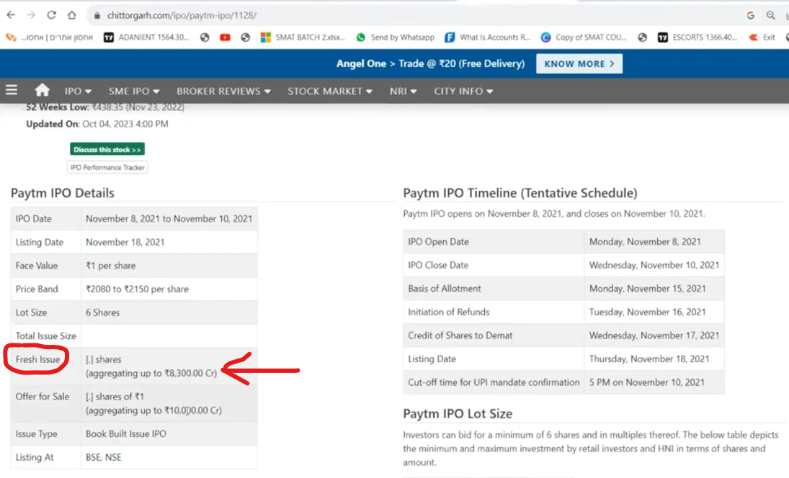
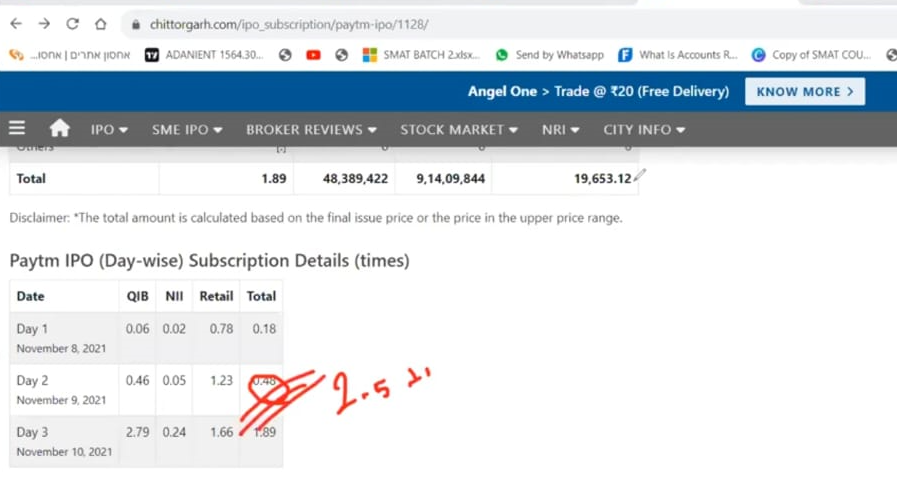
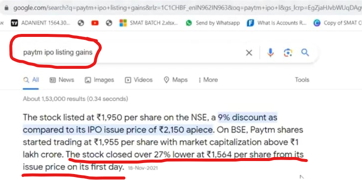
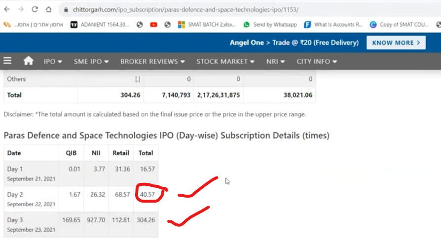
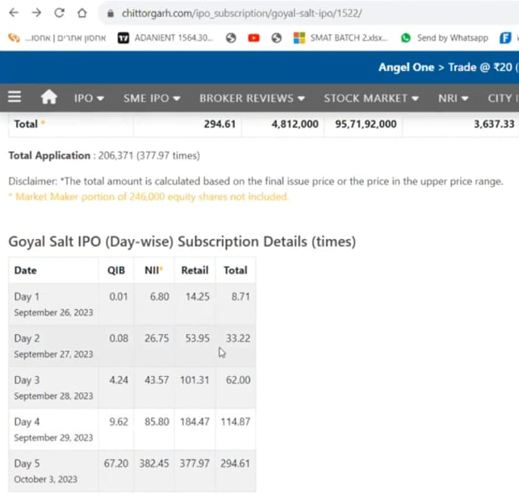
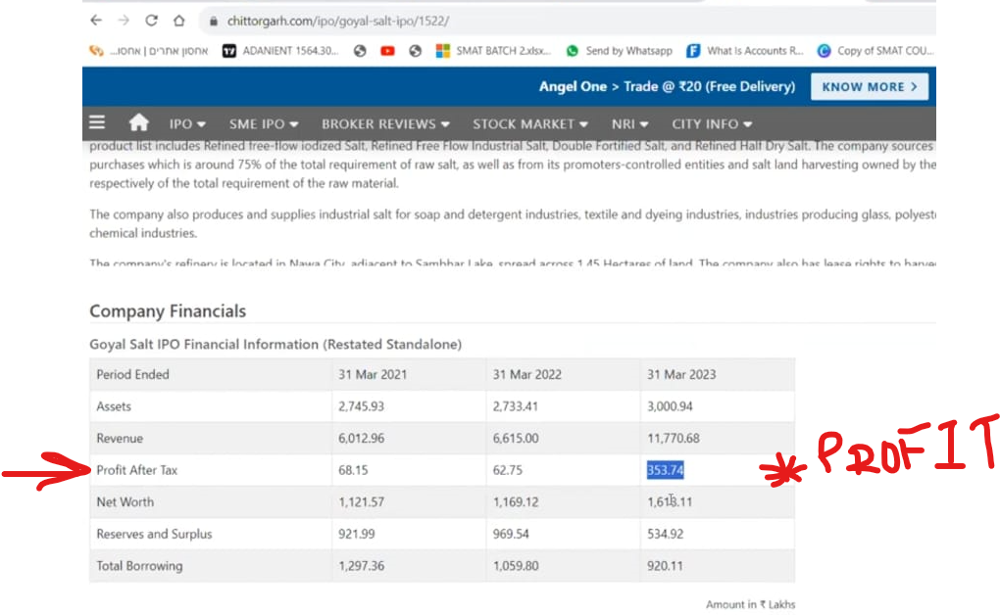
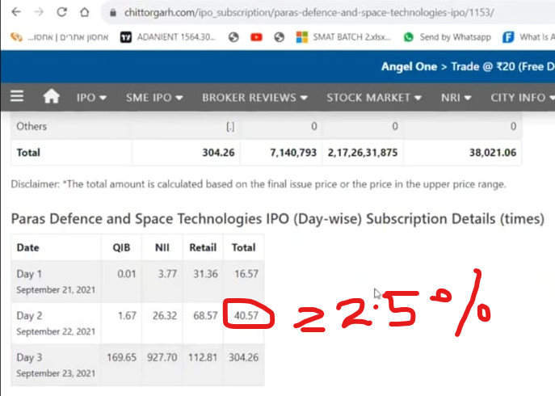
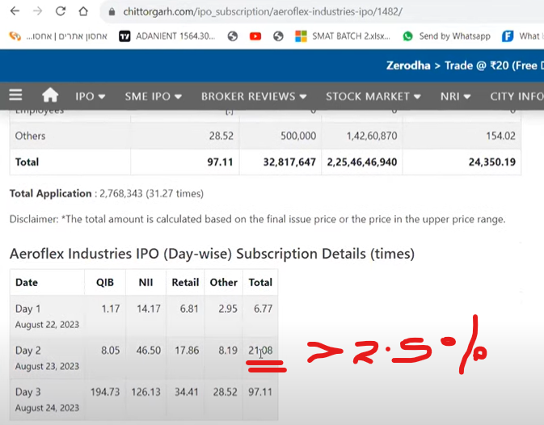
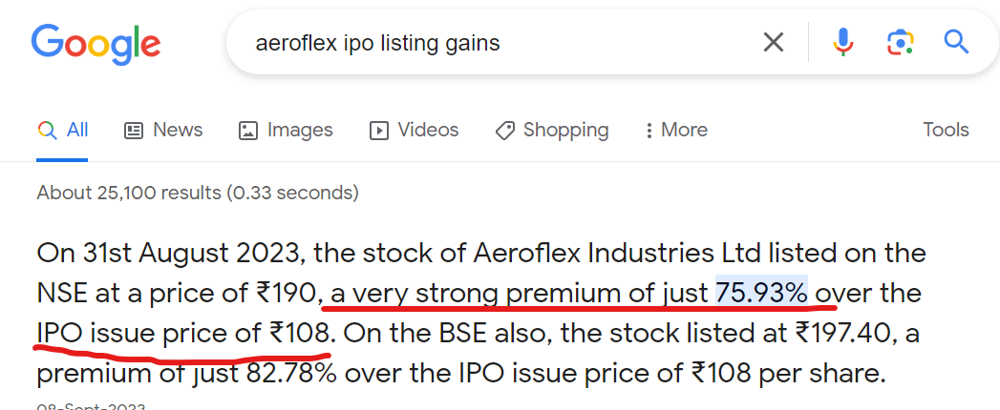

## 0. IPO

### 1. Flow for business entering into market:
    - Idea
    - Investment - Family, Friends
    - Angel Investor - Based on the Valuation of the company.
    - Vwnture Capital
    - IPO - Initial Public Offering

### 2. Selecting IPO 

    - Check the subsciption details 
    - Day 2 - if company has >= 2.5% subscription by day2. 
    - Analyse subscription % with required fund.
    - Analyse the <stock-name> listing gains.
--

