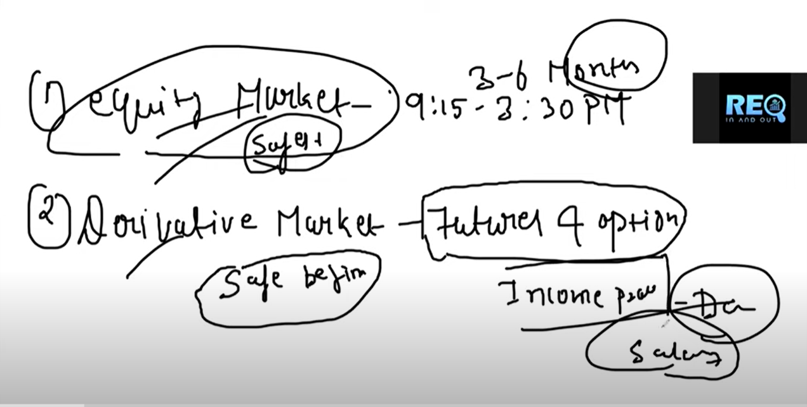
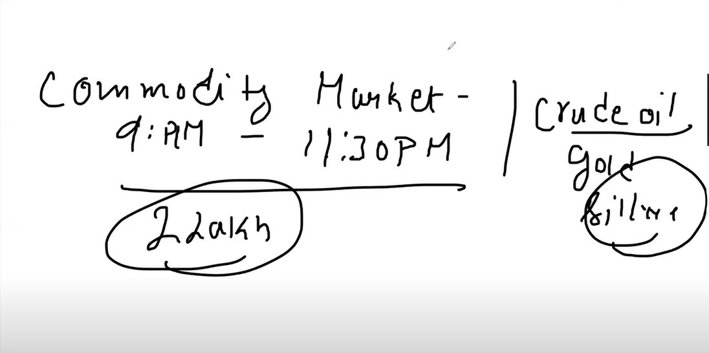
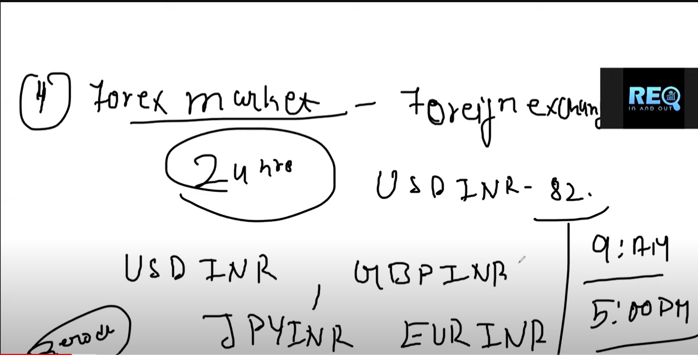
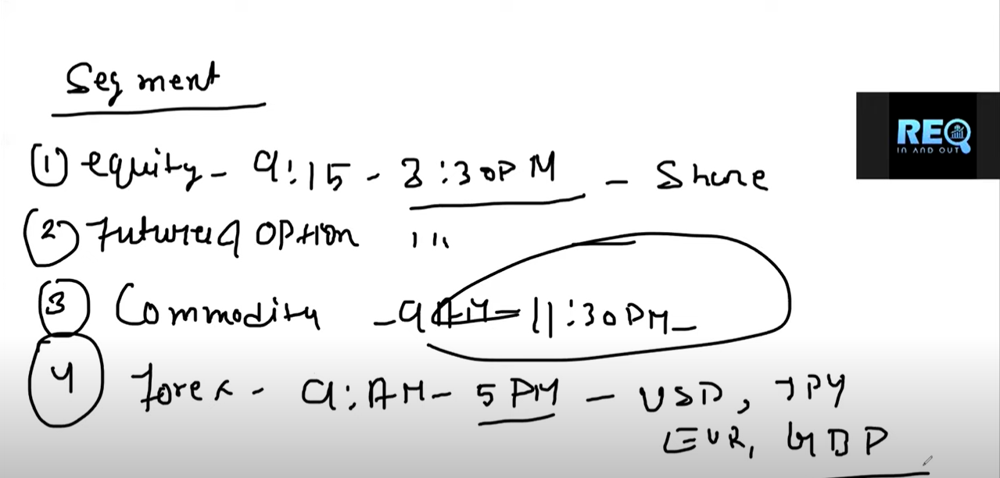
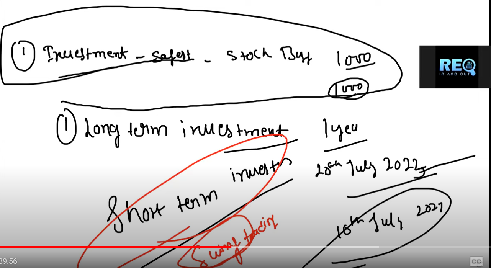
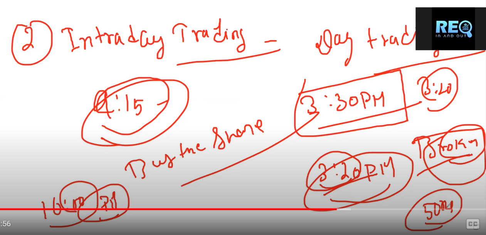
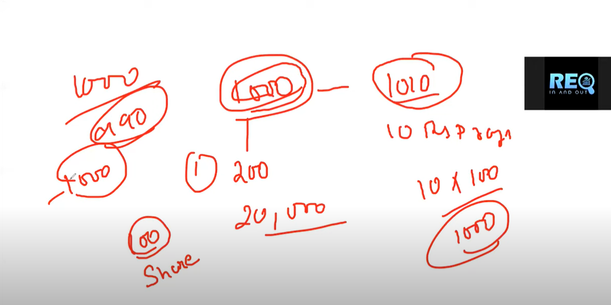

## 1.Types of Market
    - Equity Market
    - Derivative Market {Future and Options}
    - Commodity Market
    - Forex Market

## 2. Types Of Investments
    - Long Term LTI
    - Short Term STI / Swing Trading
    - Intra day

__Note Taxes on LTI and STI__

    - Interaday timing 9:15AM to 3:30PM.
    - Buy - sell on the same day before 3:20PM.
    - Broker charges 50/- fine if not sold.
    - Automatic sell of the share take place.

    - Let normal investment price is 1000/- per share. On purchase of 100 quantity total investment is 100 x 1000 = 100000.

    - Price per share on intra day is 20% of 1000 i.e 200/- per share.On purchase of 100 quantity total investment is 100 x 200 = 20000.

    - On selling shares at 1010/- per share total profit earned by invester is 10 (per share profit) x 100 (quantity) = 1000/-.