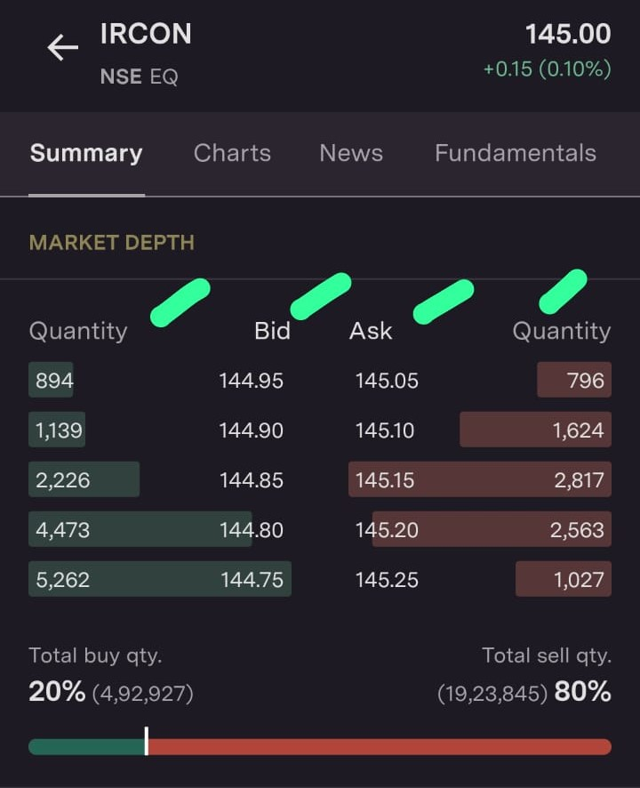
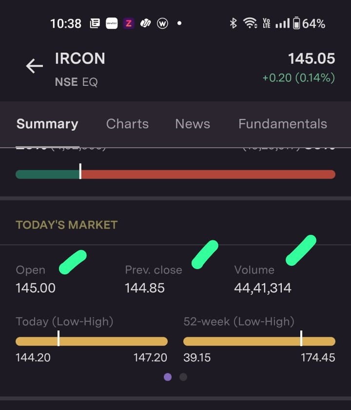
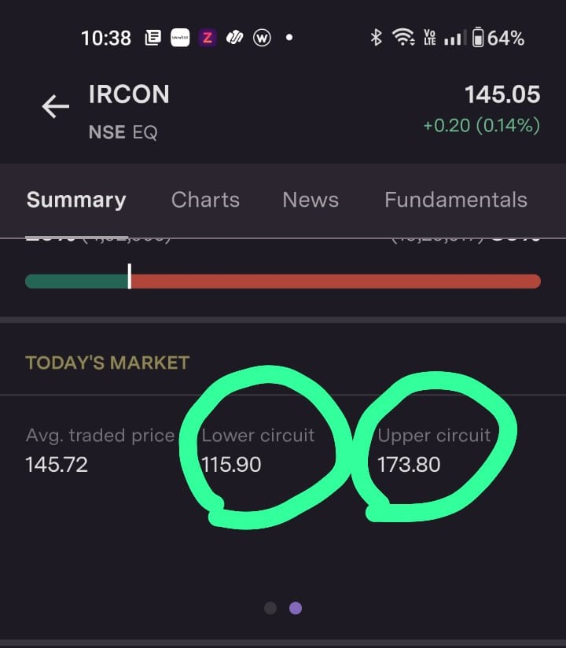

    - Quantity
    - Bid -> Expected Buying price placed by the investor.
    - Ask -> Expected selling price placed by the investor.

    - open - present day opening price
    - prev close - last day closing price
    - volume - total buy/sell quantity

    - lower circuit - lower limit for the share to fall in that particuler day.
    - upper circuit - upper limit for the share to rise in that particuler day.
---

    - Delivery(Longterm)
        - Market
        - Limit

    - Intraday(Same Day)
        - Market 
        - Limit
