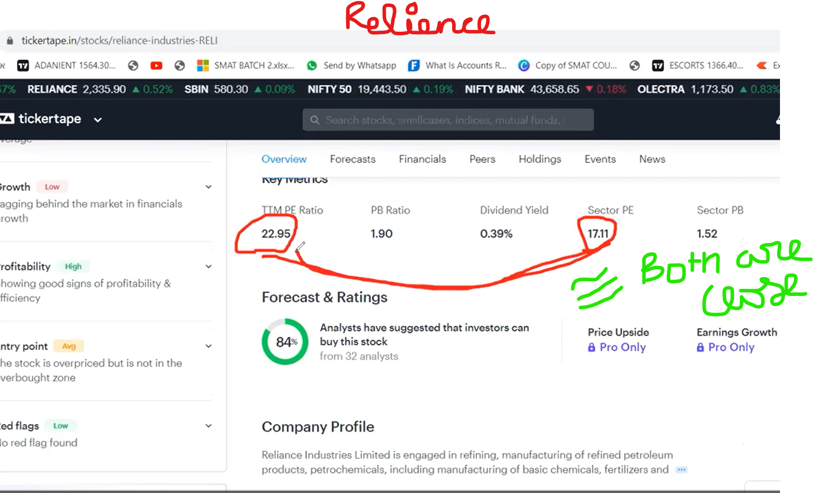
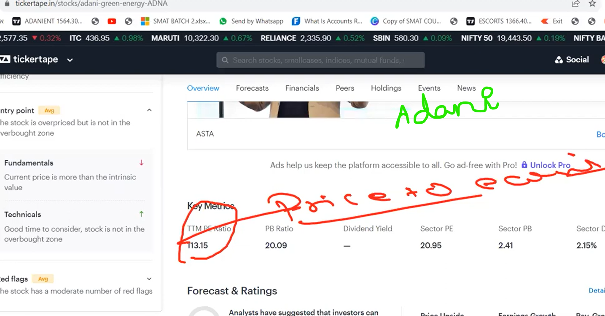

## __Day 31- Long term Investment__

__Important lookups:__
```
Future aspect
Intrensic - exact price
Current Price > intrinsic value --> NO

PE ratio - Price to earning ratio

TTM PE Ratio :
- amount required to generate 1 amount.
   ex. If 115 is the PE ratio. It means 115 units are required to genrate 1 unit of that product. Which not a good choice for the share evaluation.
- should be close to 1.
- Not less than 1 as marked the company is in loss.
- TTM Ratio close to Sector PE ratio
```
```
Future Industries:
------------------
AI
EV
Solar
Battery 
Chip set 
semiconductor
Green Energy
```


__Comparision of companies resourse:__    

[Refer Link](https://www.tickertape.in/)





